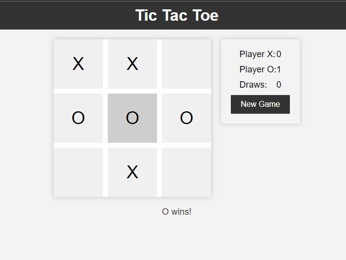

# Tic Tac Toe Game

## Features

- Play Tic Tac Toe against another player.
- Responsive design for both desktop and mobile devices.
- Keeps track of wins for Player X and Player O.
- Counts draws when the game ends in a tie.
- Reset the game at any time with the "New Game" button.

## How to Play

1. Open `index.html` in your web browser.
2. Player X starts the game. Click on a cell to make a move.
3. Alternate turns between Player X and Player O.
4. The first player to get three in a row (horizontally, vertically, or diagonally) wins.
5. If all cells are filled and no one has won, the game is a draw.
6. Click the "New Game" button to start a new game at any time.

## Technologies Used

- HTML
- CSS
- JavaScript

## Author

- SomeOne

## License

This project is licensed under the MIT License - see the [LICENSE](LICENSE) file for details.

## Acknowledgments

- Inspired by classic Tic Tac Toe games.

Enjoy playing!

